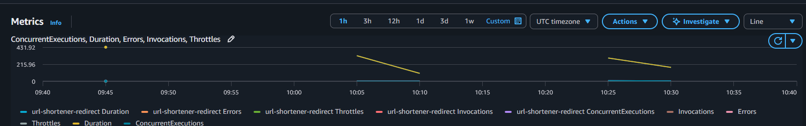

# URL Shortener — Serverless on AWS

A production-grade serverless URL shortener with real-time analytics. Built with API Gateway, Lambda (Python 3.12), and DynamoDB. Deployed automatically via GitHub Actions on every push to main.

**Live demo:** https://tg9mlyqb01.execute-api.ap-south-1.amazonaws.com/prod/shorten

## Architecture

```
POST /shorten         -> Lambda (shorten.py)   -> DynamoDB (urls table)
GET /{code}           -> Lambda (redirect.py)  -> DynamoDB lookup + click log -> 301
GET /analytics/{code} -> Lambda (analytics.py) -> DynamoDB query -> JSON
```

## Benchmark (ap-south-1, 1,000 requests, 8 concurrent)

Server-side Lambda duration (CloudWatch, warm) and end-to-end client latency
(measured from a client to the Mumbai region over the public internet):

| Metric | Server-side (Lambda) | End-to-end (client) |
|--------|----------------------|---------------------|
| p50 | ~176ms | 252ms |
| p95 | ~280ms | 280ms |
| p99 | ~526ms | 526ms |
| Error rate | 0% | 0% |
| Monthly capacity | ~1M req ($0 on Free Tier) | |

The `GET /{code}` path performs two DynamoDB operations per request (URL lookup +
click-event write), which is the bulk of the server-side time. End-to-end latency
is dominated by network round-trip to the region.

## Usage

```bash
# Shorten a URL
curl -X POST https://tg9mlyqb01.execute-api.ap-south-1.amazonaws.com/prod/shorten \
  -H "Content-Type: application/json" \
  -d '{"url": "https://example.com/very/long/path"}'

# Follow the short URL
curl -I https://tg9mlyqb01.execute-api.ap-south-1.amazonaws.com/prod/YfH7kE

# Get analytics
curl https://tg9mlyqb01.execute-api.ap-south-1.amazonaws.com/prod/analytics/YfH7kE
```

## Monitoring (CloudWatch)

Each Lambda streams logs and metrics (Duration, Invocations, Errors, Throttles)
to CloudWatch. To view the dashboard:

```
AWS Console -> CloudWatch -> Log groups -> /aws/lambda/url-shortener-redirect -> Metrics
```



> Save your screenshot as `docs/cloudwatch.png` to render it here.

## Stack

- AWS Lambda (Python 3.12)
- Amazon DynamoDB (On-Demand, TTL enabled)
- Amazon API Gateway (REST, Regional)
- Amazon CloudWatch (logs + metrics)
- GitHub Actions (CI/CD: test -> deploy on push to main)

## CI/CD

Every push to `main` triggers: `pytest` -> package -> `aws lambda update-function-code`. Tests use `moto` (AWS mock) so no real AWS calls in CI.

## Resume bullet

Built a serverless URL shortener on AWS (API Gateway, Lambda, DynamoDB) with real-time analytics (geo, device, click-through rate); deployed via GitHub Actions CI/CD. Handles ~1M req/month with 0% error rate at $0 infrastructure cost on the AWS Free Tier.